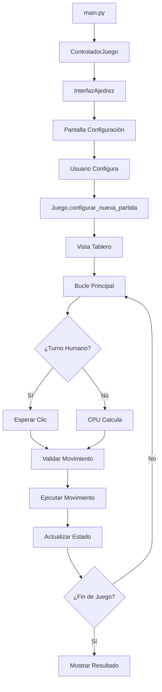

# 🏆 ChessPy - Juego de Ajedrez Completo en Python

Un juego de ajedrez completamente funcional implementado en Python usando Pygame, con inteligencia artificial integrada y todas las reglas oficiales del ajedrez.


## 🎯 Características Principales

### ✨ Funcionalidades del Juego

- **Interfaz Gráfica Completa**: Desarrollada con Pygame con diseño moderno y intuitivo
- **Reglas Oficiales del Ajedrez**: Implementación completa de todas las reglas FIDE
- **Inteligencia Artificial**: Librería python-chess con integración UCI a Stockfish (opcional)
- **Múltiples Modalidades**: Humano vs Humano, Humano vs CPU, CPU vs CPU
- **Sistema de Temporizadores**: Modalidades Clásico, Rápido y Blitz
- **Historial Completo**: Notación algebraica estándar (SAN) y exportación PGN

### 🏗️ Arquitectura Técnica

- **Patrón MVC**: Separación clara entre Modelo, Vista y Controlador
- **Programación Orientada a Objetos**: Diseño modular y extensible
- **Patrones de Diseño**: Strategy, Template Method, Observer, Factory
- **Logging Avanzado**: Sistema de debugging profesional
- **Código Limpio**: Una clase por archivo, documentación en español

## 🚀 Instalación y Uso

### Requisitos del Sistema

```bash
Python 3.8+
pygame >= 2.0.0
python-chess >= 1.999
Stockfish (opcional, para IA de nivel profesional)
```

### Instalación

1. **Clonar el repositorio:**

```bash
git clone https://github.com/tu-usuario/ajedrez_pre.git
cd ajedrez_pre
```

2. **Instalar dependencias:**

```bash
pip install -r requirements.txt
```

3. **Instalar Stockfish (opcional para IA avanzada):**
   - **Windows**: Descargar desde [stockfishchess.org](https://stockfishchess.org/download/)
   - **macOS**: `brew install stockfish`
   - **Linux**: `sudo apt-get install stockfish`
   - **Nota**: Sin Stockfish, la CPU usará un algoritmo simple interno

### Ejecución

```bash
python main.py
```

## 📁 Estructura del Proyecto

```
ajedrez_pre/
│
├── main.py                    # Punto de entrada principal
├── requirements.txt           # Dependencias del proyecto
│
├── model/                     # 🧠 MODELO - Lógica del juego
│   ├── juego.py              # Gestión del estado global
│   ├── tablero.py            # Representación del tablero
│   ├── validador_movimiento.py   # Validación de reglas
│   ├── ejecutor_movimiento.py    # Ejecución de movimientos
│   ├── evaluador_estado_de_juego.py # Detección de finales
│   ├── gestor_del_historico.py   # Historial y notación
│   ├── temporizador.py       # Sistema de tiempos
│   ├── configuracion_juego.py # Configuraciones de partida
│   │
│   ├── piezas/               # Jerarquía de piezas
│   │   ├── pieza.py         # Clase base abstracta
│   │   ├── rey.py           # Implementación del Rey
│   │   ├── reina.py         # Implementación de la Reina
│   │   ├── torre.py         # Implementación de la Torre
│   │   ├── alfil.py         # Implementación del Alfil
│   │   ├── caballo.py       # Implementación del Caballo
│   │   └── peon.py          # Implementación del Peón
│   │
│   └── jugadores/            # Sistema de jugadores
│       ├── jugador.py       # Clase base abstracta
│       ├── jugador_humano.py # Jugador humano
│       └── jugador_cpu.py   # IA con python-chess + Stockfish UCI
│
├── view/                     # 🎨 VISTA - Interfaz gráfica
│   └── interfaz_ajedrez.py  # Interfaz completa con Pygame
│
├── controller/               # 🎮 CONTROLADOR - Lógica de control
│   └── controlador_juego.py # Coordinación MVC
│
├── assets/                   # 📁 Recursos estáticos
│   ├── imagenes_piezas/     # Sprites de las piezas
│   ├── chess_rules/         # Documentación de reglas
│   └── *.md, *.pdf          # Documentación y diagramas
│
├── tests/                    # 🧪 Tests unitarios
│   ├── model/               # Tests del modelo
│   └── controller/          # Tests del controlador
│
└── chats/                    # 📝 Historial de desarrollo
    └── *.md                 # Registros de conversaciones
```

## 🎮 Guía de Uso

### Pantalla de Configuración

1. **Seleccionar Tipo de Juego:**

   - Clásico (90 min + 30 seg/movimiento)
   - Rápido (25 min + 10 seg/movimiento)
   - Blitz (3 min + 2 seg/movimiento)

2. **Elegir Modalidad:**

   - Humano vs Humano
   - Humano vs CPU
   - CPU vs Humano
   - CPU vs CPU

3. **Configurar Dificultad CPU:**
   - Nivel 1 (Principiante)
   - Nivel 3 (Intermedio)
   - Nivel 5 (Avanzado)
   - Nivel 10 (Experto)

### Durante la Partida

- **Seleccionar Pieza**: Clic en una pieza propia
- **Ver Movimientos**: Los movimientos válidos se resaltan automáticamente
- **Mover Pieza**: Clic en casilla destino válida
- **Promoción**: Seleccionar pieza en popup automático
- **Historial**: Panel lateral muestra movimientos en notación algebraica

## 🏛️ Arquitectura del Sistema

### Patrón Modelo-Vista-Controlador (MVC)

#### 🧠 **MODELO** - Lógica del Negocio

```python
# Componentes principales del modelo
Juego              # Coordinador general del estado
├── Tablero        # Estado del tablero y piezas
├── Validador      # Validación de reglas
├── Ejecutor       # Ejecución de movimientos
├── Evaluador      # Detección de finales
├── Gestor         # Historial y repeticiones
└── Jugadores      # IA y jugadores humanos
```

#### 🎨 **VISTA** - Interfaz de Usuario

```python
InterfazAjedrez    # Interfaz gráfica completa
├── Configuración  # Pantalla inicial
├── Tablero        # Vista de juego
├── Popups         # Promoción y fin de juego
└── Paneles        # Información y controles
```

#### 🎮 **CONTROLADOR** - Lógica de Control

```python
ControladorJuego   # Coordinador MVC
├── Eventos        # Manejo de input del usuario
├── Estado         # Gestión del estado del juego
└── Comunicación   # Modelo ↔ Vista
```

## ⚙️ Patrones de Diseño Implementados

### 🎯 **Strategy Pattern**

- **ValidadorMovimiento**: Diferentes algoritmos de validación
- **EjecutorMovimiento**: Estrategias de ejecución
- **EvaluadorEstado**: Múltiples evaluadores de estado

### 🏗️ **Template Method**

- **Pieza.obtener_movimientos_legales()**: Algoritmo general
- Subclases implementan partes específicas (`obtener_movimientos_potenciales()`)

### 👁️ **Observer Pattern**

- Controlador observa eventos de la vista
- Modelo notifica cambios de estado

### 🏭 **Factory Method**

- Creación dinámica de jugadores según modalidad
- Instanciación de piezas específicas

## 🔄 Flujo de Trabajo del Juego



## 🧪 Testing

Ejecutar tests unitarios:

```bash
# Todos los tests
pytest tests/

# Tests específicos del modelo
pytest tests/model/

# Tests del controlador
pytest tests/controller/

# Test específico
pytest tests/model/test_tablero.py
```

## 🚀 Reglas del Ajedrez Implementadas

### ✅ **Movimientos Básicos**

- [x] Peón (movimiento doble inicial, promoción)
- [x] Torre (movimiento horizontal/vertical)
- [x] Caballo (movimiento en L)
- [x] Alfil (movimiento diagonal)
- [x] Reina (combinación torre + alfil)
- [x] Rey (un paso en cualquier dirección)

### ✅ **Reglas Especiales**

- [x] **Enroque** (corto y largo)
- [x] **Captura al Paso** (en passant)
- [x] **Promoción de Peón**
- [x] **Detección de Jaque**
- [x] **Detección de Jaque Mate**
- [x] **Detección de Ahogado**

### ✅ **Condiciones de Tablas**

- [x] Material insuficiente
- [x] Triple repetición de posición
- [x] Regla de los 50 movimientos
- [x] Ahogado

## 🤖 Inteligencia Artificial

### Arquitectura de IA

- **Librería Base**: `python-chess` para lógica de ajedrez y manejo de tablero
- **Motor UCI**: Comunicación con Stockfish (si está disponible)
- **Fallback Inteligente**: Algoritmo simple interno si Stockfish no está instalado
- **Niveles de Dificultad**: 1-10 configurados por tiempo de cálculo

### Configuración de IA

```python
# Niveles disponibles (con Stockfish)
NIVEL_1 = "Principiante"    # 0.1s de cálculo
NIVEL_3 = "Intermedio"      # 0.5s de cálculo
NIVEL_5 = "Avanzado"        # 1.0s de cálculo
NIVEL_10 = "Experto"        # 3.0s de cálculo

# Sin Stockfish: algoritmo aleatorio mejorado
```

## 📈 Funcionalidades Avanzadas

### 🕐 **Sistema de Temporizadores**

- Modalidades oficiales (Clásico, Rápido, Blitz)
- Incremento por movimiento
- Visualización en tiempo real

### 📝 **Historial y Notación**

- Notación algebraica estándar (SAN)
- Exportación PGN para compatibilidad
- Historial completo de partida

### 🎨 **Interfaz Avanzada**

- Resaltado de movimientos válidos
- Indicadores visuales de capturas
- Animaciones suaves
- Popups informativos

## 🛠️ Desarrollo y Contribución

### Reglas de Desarrollo

- **OOP Puro**: Una clase por archivo
- **Comentarios en Español**: Documentación clara
- **Logging**: Sin prints, solo logging
- **Tests**: Pytest para todas las funcionalidades
- **MVC Estricto**: Separación clara de responsabilidades

### Estructura de Commits

```bash
git commit -m "feat(model): añadir validación de enroque"
git commit -m "fix(view): corregir renderizado de piezas"
git commit -m "docs(readme): actualizar documentación"
```

## 🐛 Debugging y Logs

El sistema incluye logging avanzado:

```python
# Configuración en main.py
logging.basicConfig(
    level=logging.INFO,
    format='%(asctime)s - %(name)s - %(levelname)s - %(message)s'
)
```

## 📄 Licencia

Este proyecto está bajo la Licencia MIT. Ver el archivo `LICENSE` para más detalles.

## 👥 Equipo de Desarrollo

- **Desarrolladores**: Pol Cabezas Agustí, Ignasi Ruiz Belager
- **Asistente IA**: Claude Sonnet 4 (Análisis y Documentación)

## 🙏 Agradecimientos

- **Python-chess Team**: Por la excelente librería de ajedrez
- **Stockfish Team**: Por el potente motor de ajedrez UCI
- **Pygame Community**: Por la fantástica librería gráfica
- **FIDE**: Por las reglas oficiales del ajedrez

---

⭐ **¡Si te gusta este proyecto, dale una estrella!** ⭐
